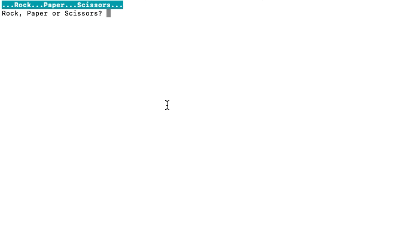

# Mini-games 

**Guessing game** and **Rock Paper Scissors** are two simple terminal games written in Python.

Both games have minor styling added from **termcolor 1.1.0**. It can be installed with **pip install termcolor**

* **Guessing game**

Takes a guess from user and compares it to a randomly generated number. It provides hints such as 'Number is too high' or 'Number is too low'.

Game continues until the correct number is guessed. After that game prompts to start a new game which could be declined by typing 'no'.

Here is the demo: 

* **Rock Paper Scissors** 

Classic Rock Paper Scissors game. Player is competing against computer. Computer is picking a randomly generated option in each round.

There are three rounds in total. Each time someone wins, one point is awarded. In case of a tie, no points awarded. 

Game finishes when one of the participants gets 3 points. After that game prompts to start a new game which could be declined by typing 'no'.

Here is the demo: 

